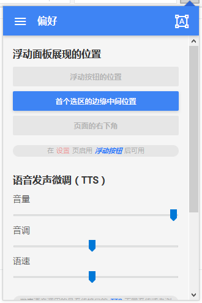
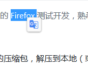
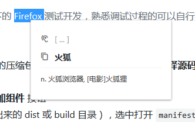

## 项目介绍
> 一个类 Material Design 风格，支持最新火狐浏览器的轻量翻译辅助扩展。

> 这个扩展由原先自用的简易翻译改进而来的，大多数需求仍是依照个人使用习惯设计实现，当前只支持 Firefox，未进行 Chrome 兼容移植，有兴趣的话可尝试一下。

~~近期 Google 翻译服务回归大陆了，许多基于其接口的优秀扩展都可以恢复使用了，大概，所以就不继续造轮子了，~~ 这款扩展仍旧保持之前版本的文档阅读辅助的定位，全文翻译和段落翻译近期的版本不会再加入了。

如果需要测试还未发布的版本，可以参考 [临时加载扩展](#临时加载扩展)，由于添加了扩展签名，加载后会临时覆盖已安装的版本，但重启浏览器之后就会恢复，不影响之前的安装。

## 项目进展状态
> 观望火狐对 WebExtension 的支持，在有足够多满意的接口实现后计划使用 Vue2 重构 UI（现在没有使用任何库和框架），减少复杂交互时开发上的分心。

`pre-Alpha` ==> `Alpha` ==> `Beta √👻` => `RC`

## 准备完成的特性
+ √ 类 Material Design 界面
+ ~~自动中英互译~~
+ √ 多翻译来源选择
+ √ 手动选择语言进行翻译
+ √ ~~中文、英文音标~~
+ √ ~~中文、英文朗读~~
+ √ TTS 和 翻译源发音
+ √ 选词翻译
+ 节选翻译段落
+ ~~全文翻译~~
+ √ 多种交互方式
+ √ 可配置选项（~~同步账户~~）
+ 简易词汇收藏
+ ……

## 下载安装
[https://addons.mozilla.org/zh-CN/firefox/addon/weel-translate/](https://addons.mozilla.org/zh-CN/firefox/addon/weel-translate/)

## 截图预览
> 一些截图内容可能已经过时。

## 临时加载扩展
> 目前还只在 Windows 系统下的 Firefox 测试开发，熟悉调试过程的可以自行操作，Chrome 的调试过程类似

#### Firefox >=48
0. 从 [Releases](https://github.com/wallenweel/weel-translation-extension/releases) 下载最新版本的压缩包，解压到本地（或者使用下面 **编译源码** 编译项目）
0. 打开 `[附加组件调试](about:debugging#addons)` 页面
0. 点击右上角的 **临时加载附加组件** 按钮
0. 找到解压目录（或者编译出来的 dist 或 build 目录），选中打开 `manifest.json` 文件
0. 成功之后，附加组件就多出了一个和项目同名的项，浏览器工具栏也出现了相同的图标按钮

## 编译源码
> 仓库的 master 分支为稳定版本（可编译通过，没有明显 bug），项目使用的自动化工具（gulp-next）是我根据自己习惯定制的，也同时在仓库的项目中可以找到。

0. 首先 clone 项目的 master 分支到本地
0. 进入项目的根目录，执行 `npm install` 命令安装所需的依赖
0. 等待依赖安装完毕，执行 `npm run build` 进行编译
0. 也可以执行 `npm start` 开启一个 web 服务，可以实时查看修改后的界面

## 贡献代码
现在采取的分支管理方式是在 develop 上进行开发，master 仅用来合并，如果提交代码的话请提交到 develop 分支（对 git 只有通常的使用经验，如果有任何问题欢迎告知~）
