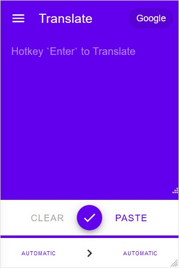
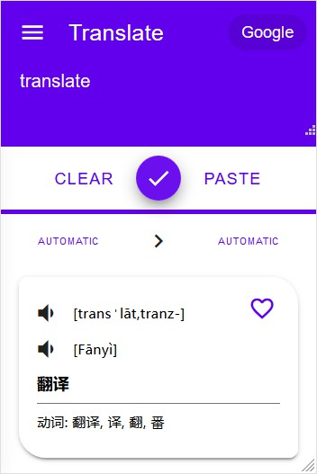

# Weel Translate MD
> Material Design Style Web Extension for Languages Translating.

## Screenshots



## ~~Get Started~~
> developing, no release now.

support debug in normal web mode:

1. clone this repo's `develop` branch
2. run `yarn install` or `npm install` in project's root directory
3. run `yarn serve` or `npm run serve` start a development serve for web debug
4. visit `http://localhost::8080/popup/main.html` and press `F12` open web console then triggle mobile mode
5. done, but install "cors" ignore extension for avoiding CORS Error from translation source

## Main Features
- [x] Support base translation (out of the box)
- [x] Main translation in popup page (Browser Action)
- [ ] Float translation panel in web page (Content Script)
- [ ] Easy frontend settings
- [ ] Base customizable components (in frontend settings)
- [ ] Advance preset templates costom support (in options page)
- [ ] Support web infomation crawler (for sources that no api)
- [ ] Custimizable styles
- [ ] Multiple UI languages support (Ready: `en`, `zh-cn`)

## Advance Features
> contine using without updating.

### Add Translation Source Presets
> For modifing more translation sources.

#### Interface:
```typescript
declare type presetId = string;

declare interface Preset {
  // translation source's id, only accpet en words
  // and "_" as separator
  readonly id: presetId;
  // extends a full preset, by source's id
  // must be set in children preset
  readonly extends?: presetId;

  [index: string]: any;
}

declare type sourceId = presetId;

declare interface SourcePreset extends Preset {
  readonly id: sourceId;

  readonly extends?: sourceId;

  // display name
  readonly name?: string;

  // query.<type>.url can override this
  url: string;

  // request method
  method?: 'get' | 'post' | string;

  // translation request
  // if false, use xhr or fetch by "url" and
  // parser's selectors as Dom selector
  query?: {
    text: TextQuery;
    audio?: AudioQuery;
  } | false;

  // parse response result
  // must be set in parent preset, optional in children
  // preset which has extends
  parser?: {
    [name: string]: selector;
  };

  // support ['auto:>AUTO', 'zh-cn:>zh-CHS', ...]
  // or [['auto', 'AUTO'], ['zh-cn', 'zh-CHS'], ...]
  // or [[{ code: 'auto' }, { code: 'AUTO' }], ...]
  modify?: string[] |
    Array<Language['code'][]> |
    Array<[
      { code: Language['code'], name?: Language['name'], locale?: Language['locale'] },
      { code?: Language['code'], name?: Language['name'], locale?: Language['locale'] }
    ]>;

  // initial translating direction
  fromto: [Language['code'], Language['code']];

  // just include necessary languages
  // if not exist, load all of languages
  include?: Array<Language['code']>;

  // invalid when "include" is set
  // if exist, exclude from all languages
  exclude?: Array<Language['code']>;
}

declare interface Language {
  readonly code: string; // standard language code
  readonly name: string; // show when has not "locale"
  readonly locale?: string; // for i18n translation
}

declare type queryParams = string | { [param: string]: string | string[]; } | string[][];
declare interface TextQuery {
  method: 'get' | 'post' | string;
  url: string;
  params: queryParams;
}

declare interface AudioQuery extends TextQuery {
  tune?: any;
}

// object index such as "a.b.c" or Dom selecotr
declare type selector = string | string[] | undefined;
```

#### Example:
```json
{
  "id": "google_com",
  "name": "Google",
  "url": "https://translate.google.com",
  "query": {
    "text": {
      "method": "get",
      "url": "{{url}}/translate_a/single",
      "params": {
        "q": "{{q}}",
        "sl": "{{from}}",
        "tl": "{{to}}",
        "hl": "{{to}}",
        "client": "gtx",
        "ie": "UTF-8",
        "oe": "UTF-8",
        "dt": ["bd", "rm", "t"],
        "dj": "1",
        "source": "icon"
      }
    },
    "audio": {
      "method": "get",
      "url": "{{url}}/translate_a/translate_tts",
      "params": {
        "q": "{{q}}",
        "tl": "{{from}}",
        "client": "gtx",
        "ie": "UTF-8"
      }
    }
  },
  "parser": {
    "phonetic_src": "sentences.-0.src_translit",
    "phonetic_dest": "sentences.-0.translit",
    "translation": "$.sentences[0,-1]{trans}<\n>",
    "explain": "dict.0.pos/: /dict.0.terms<, >"
  },
  "fromto": ["auto", "auto"]
}
```

### Add Web Crawler (*not yet implement*)
> For fast getting more other infomation or using some translation source without standard api service.

#### Interface:
#### Example:

### Add Template Layout
> For customizing how response results are showed.

#### Interface:
```typescript
declare type templateId = presetId;

declare interface LayoutPreset extends Preset {
  id: templateId;
  extends?: templateId;

  // check has or not existed "keys" in result. such as
  // test ['phonetic', 'translation'] in result { phonetic: '...', translation: '...' } is true
  test: string[],

  // layout
  rows: string[][];

  title?: string;
  description?: string;
}
```
#### Example:
```json
 {
  "id": "default_popup",
  "test": ["phonetic_src", "phonetic_dest", "translation", "explain"],
  "title": "Default For Popup",
  "description": "default translation result template in popup page.",
  "rows": [
    ["<pick>"],
    ["<voice?src>", "[", "{phonetic_src}", "]"],
    ["<voice?dest>", "[", "{phonetic_dest}", "]"],
    ["{translation}"],
    ["{explain}"]
  ]
}
```
```json
{
  "id": "default_float",
  "test": ["phonetic_dest", "translation", "explain"],
  "title": "Default For Float",
  "description": "default translation result template in content page as float panel.",
  "rows": [
    ["<voice-dest>", "`", "{phonetic_dest}", "`"],
    ["{translation}"],
    ["{explain}"],
  ]
}
```


## Project setup
```ini
# Install dependencies
yarn install

# Compiles and hot-reloads for development (web mode)
yarn run serve

# Compiles and minifies for production (dist/web)
yarn run build

# Compiles and minifies for production (dist/firefox)
yarn run build:firefox

# Compiles and auto reloads for development (dist/firefox)
yarn run watch:firefox

# Strat a temporary browser for development (dist/firefox)
yarn run webext:firefox

# Package a .zip extension file for publishing (web-ext-artifacts/)
yarn run pack:firefox

# Run unit tests
yarn run test:unit
```
