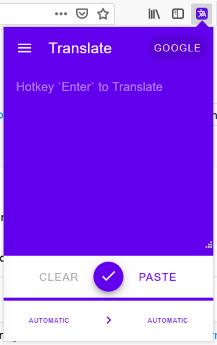
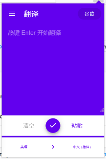
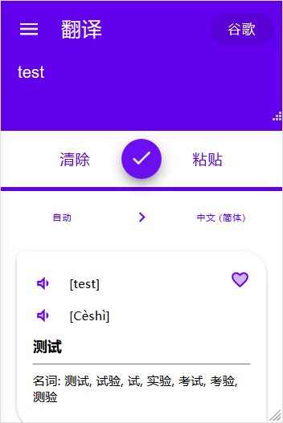
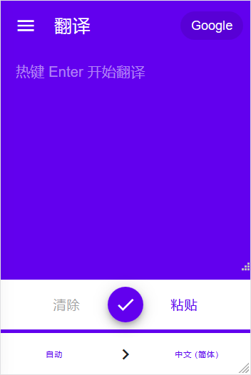
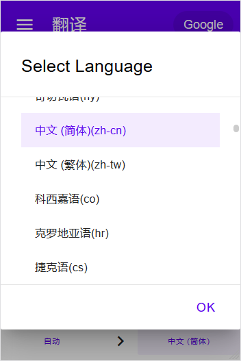
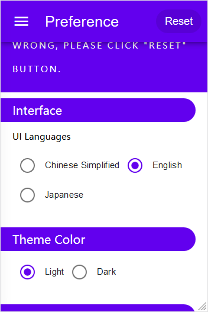
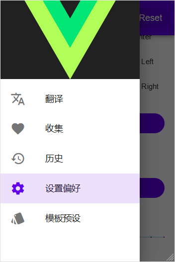
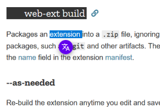
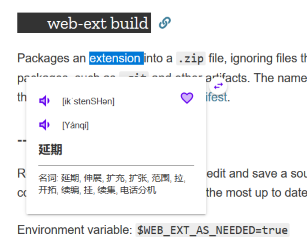

# Weel Translate X (V3.0)

> Material Design Style Translation Extension for Languages.

- [Weel Translate X (V3.0)](#weel-translate-x-v30)
  - [Screenshots](#screenshots)
  - [Get Started](#get-started)
    - [First](#first)
    - [Build For AMO (Firefox)](#build-for-amo-firefox)
    - [Build For Firefox Testing](#build-for-firefox-testing)
    - [Dev & Debug In "web" Mode](#dev--debug-in-%22web%22-mode)
  - [Main Features List](#main-features-list)
  - [Advance Features (_not completed yet_)](#advance-features-not-completed-yet)
    - [Custom Translation Source Presets](#custom-translation-source-presets)
      - [Source Interface](#source-interface)
      - [Source Example](#source-example)
    - [Add Web Crawler](#add-web-crawler)
      - [Crawler Interface](#crawler-interface)
      - [Crawler Example](#crawler-example)
    - [Add Template Layout](#add-template-layout)
      - [Layout Interface](#layout-interface)
      - [Layout Example](#layout-example)
  - [Project Setup](#project-setup)

## Screenshots

> all captured in production  mode.












## Get Started

### First

Now this project still in develping, every progresses all in **develop** branch.

### Build For AMO (Firefox)

1. run `yarn install` to install nessary dependencies
2. run `yarn pack:amo` to build extension for publishing
3. ouput files:  __dist/firefox/**/*__
4. zip format extension file: __web-ext-artifacts/amo/weel_translate_x-[3.x.x].zip__

### Build For Firefox Testing

> This case will use `@translate-weel-x` id that defined in **mainfest.json**, but build for AMO will be set `@translate-weel` id automatically.

1. run `yarn install`
2. run `yarn pack:firefox`
3. output files same with above
4. zip file:  __web-ext-artifacts/weel_translate_x-[3.x.x].zip__
5. visit [about:debugging#addons](about:debugging#addons) and click **Load Temporary Add-on** to select the zip file or __[output]/manifest.json__

### Dev & Debug In "web" Mode

1. clone this repo's `develop` branch to local
2. run `yarn install` or `npm install` in project's root directory
3. run `yarn serve` or `npm run serve` start a development serve for web debug
4. visit `http://localhost::8080/popup/main.html` and could press `F12` open web console then triggle mobile mode
5. done, but install "cors" ignore extension for avoiding CORS Error from translation source.

## Main Features List

- [x] Support base translation (out of the box)
- [x] Main translation in popup page (Browser Action)
- [x] Float translation panel in web page (Content Script)
- [x] Easy frontend settings
- [ ] Base customizable components (in frontend settings)
- [ ] Advance preset templates costom support (in options page)
- [ ] Support web infomation crawler (for sources that no api)
- [x] Support translating histories & picks
- [ ] Custimizable styles
- [x] Multiple UI languages support (Already: `en`, `zh-cn`)

## Advance Features (_not completed yet_)

### Custom Translation Source Presets

> For the situation when some tranaltion source services changed their things, but still could contine using without updating this extension.

#### Source Interface

```typescript
declare type presetId = string;

declare interface Preset {
  // translation source's id, only accpet en words
  // and "_" as separator
  readonly id: presetId;
  // extends a full preset, by source's id
  // must be set in children preset
  readonly extends?: presetId;

  [index: string]: any;
}

declare type sourceId = presetId;

declare interface SourcePreset extends Preset {
  readonly id: sourceId;

  readonly extends?: sourceId;

  // display name
  readonly name?: string;

  // query.<type>.url can override this
  url: string;

  // request method
  method?: 'get' | 'post' | string;

  // translation request
  // if false, use xhr or fetch by "url" and
  // parser's selectors as Dom selector
  query: {
    text: TextQuery;
    audio?: AudioQuery;
  } | false;

  // parse response result
  // must be set in parent preset, optional in children
  // preset which has extends
  parser: { [name: string]: selector; };

  // test parser's item whether got vaild result or not
  // use string as RegExp param: '\\w\\W+'  
  // use custom placeholder repeat default: ['.+', 'Not Existed']
  test?: { [name: string]: string | [string, string]; };

  // support ['auto:>AUTO', 'zh-cn:>zh-CHS', ...]
  // or [['auto', 'AUTO'], ['zh-cn', 'zh-CHS'], ...]
  // or [[{ code: 'auto' }, { code: 'AUTO' }], ...]
  modify?: string[] |
    Array<Language['code'][]> |
    Array<[
      { code: Language['code'], name?: Language['name'], locale?: Language['locale'] },
      { code?: Language['code'], name?: Language['name'], locale?: Language['locale'] }
    ]>;

  // initial translating direction
  fromto: [Language['code'], Language['code']];

  // just include necessary languages
  // if not exist, load all of languages
  include?: Array<Language['code']>;

  // invalid when "include" is set
  // if exist, exclude from all languages
  exclude?: Array<Language['code']>;

  // custom all languages that your preset needs
  languages?: Array<Language>;
}

declare interface Language {
  readonly code: string; // standard language code
  readonly name: string; // show when has not "locale"
  readonly locale?: string; // for i18n translation
}

declare type queryParams = string | { [param: string]: string | string[]; } | string[][];
declare interface TextQuery {
  method: 'get' | 'post' | string;
  url: string;
  params?: queryParams;
  unsupport?: Language['code'][];
}

declare interface AudioQuery extends TextQuery {
  // Feature: not implement
  tune?: {
    volume: number; // float number, minimum: 0 ~ maximum: 1
  };
}

// object index such as "a.b.c" or Dom selecotr
declare type selector = string | string[] | undefined;
```

#### Source Example

```json
{
  "id": "google_com",
  "name": "Google",
  "url": "https://translate.google.com",
  "query": {
    "text": {
      "method": "get",
      "url": "{url}/translate_a/single",
      "params": {
        "q": "{q}",
        "sl": "{from}",
        "tl": "{to}",
        "hl": "{to}",
        "client": "gtx",
        "ie": "UTF-8",
        "oe": "UTF-8",
        "dt": ["bd", "rm", "t"],
        "dj": "1",
        "source": "icon"
      }
    },
    "audio": {
      "unsupport": ["auto"],
      "method": "get",
      "url": "{url}/translate_tts",
      "params": {
        "q": "{q}",
        "tl": "{from}",
        "client": "gtx",
        "ie": "UTF-8"
      }
    }
  },
  "parser": {
    "phonetic_src": "sentences.-0.src_translit",
    "phonetic_dest": "sentences.-0.translit",
    "translation": "$.sentences[0,-1]{trans}<\n>",
    "explain": "dict.0.pos/: /dict.0.terms<, >"
  },
  "test": {
    "phonetic_src": ".+",
    "phonetic_dest": ".+",
    "translation": ".+",
    "explain": ".+\\:\\s.+"
  },
  "fromto": ["auto", "auto"]
}
```

### Add Web Crawler

> For fast getting more other infomation or using some translation source without standard api service.

#### Crawler Interface

#### Crawler Example

### Add Template Layout

> For customizing how response results are showed.

#### Layout Interface

```typescript
declare type templateId = presetId;

declare interface LayoutPreset extends Preset {
  id: templateId;
  extends?: templateId;

  // layout
  rows: string[][];

  // check has or not existed "keys" in result. such as
  // expect ['phonetic', 'translation'] in result { phonetic: '...', translation: '...' } is true
  expect?: string[],

  // replace string while result's item got unexpect things
  // string: as placeholder if no content
  // string[]: [regexp string for test, regexp string as replace rule, replaceing string]
  // undefined: ignore this one
  replace?: (string | string[] | undefined)[];

  title?: string;
  description?: string;
}
```

#### Layout Example

```json
{
  "id": "standard",
  "title": "Standard Translation Result",
  "description": "Default enabled in popup and web page.",
  "expect": ["phonetic_src", "phonetic_dest", "translation", "explain"],
  "rows": [
    ["<pick?title={translation}&excerpt={explain}>"],
    ["<voice?src>", "[", "{phonetic_src}", "]"],
    ["<voice?dest={translation}>", "[", "{phonetic_dest}", "]"],
    ["{translation}"],
    ["{explain}"]
  ]
}
```

```json
{
  "id": "simple",
  "title": "Simple Translation Result'",
  "description": "Shows a few base stuffs as result.",
  "expect": ["phonetic_dest", "translation", "explain"],
  "rows": [
    ["<voice-dest>", "`", "{phonetic_dest}", "`"],
    ["{translation}"],
    ["{explain}"],
  ]
}
```

## Project Setup

```sh
# Install dependencies
yarn install

# Compiles and hot-reloads for development (web mode)
yarn run serve

# Compiles and minifies for production (dist/web)
yarn run build

# Compiles and minifies for production (dist/firefox)
yarn run build:firefox

# Compiles and auto reloads for development (dist/firefox)
yarn run watch:firefox

# Strat a temporary browser for development (dist/firefox)
yarn run webext run

# Package a .zip extension file for publishing (web-ext-artifacts/)
yarn run pack:firefox

# Package a .zip extension file for publishing (web-ext-artifacts/amo)
yarn run pack:amo

# Run unit tests
yarn run test:unit
```
