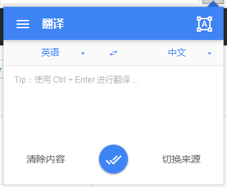
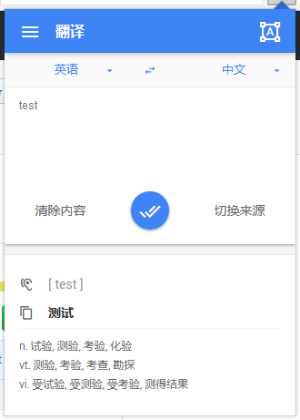
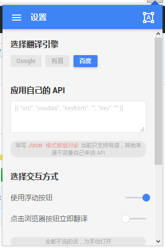
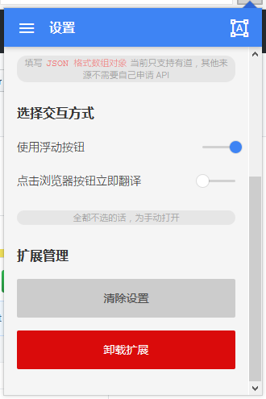
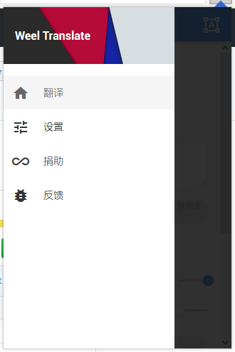

## 开始
> 这是一个基于 Web Extension 接口的浏览器翻译扩展，因为使用习惯，第一步会先在 Firefox 上实现，然后根据情况移植到 Googel Chrome 上。

## 临时加载扩展
> 目前还只在 Windows 系统下的 Firefox 测试开发，熟悉调试过程的可以自行操作，Chrome 的调试过程类似

#### Firefox >=48
0. 从 [Releases](https://github.com/wallenweel/weel-translation-extension/releases) 下载最新版本的压缩包，解压到本地（或者使用下面 **编译源码** 编译项目）
0. 打开 `[附加组件调试](about:debugging#addons)` 页面
0. 点击右上角的 **临时加载附加组件** 按钮
0. 找到解压目录（或者编译出来的 dist 或 build 目录），选中打开 `manifest.json` 文件
0. 成功之后，附加组件就多出了一个和项目同名的项，浏览器工具栏也出现了相同的图标按钮

## 准备完成的特性

+ √ 类 Material Design 界面
+ ~~自动中英互译~~
+ √ 手动选择语言进行翻译
+ √ ~~中文~~、英文音标
+ √ ~~中文~~、英文朗读
+ 选词翻译
+ 节选翻译段落
+ 全文翻译
+ 多种交互方式
+ √ 可配置选项（~~同步账户~~）
+ 简易词汇收藏
+ ……

## 项目进展状态
`pre-Alpha √👻` ==> `Alpha` ==> `Beta` => `RC`

## 截图预览

## 编译源码
> 仓库的 master 分支为稳定版本（可编译通过，没有明显 bug），项目使用的自动化工具（gulp-next）是我根据自己习惯定制的，也同时在仓库的项目中可以找到。

0. 首先 clone 项目的 master 分支到本地
0. 进入项目的根目录，执行 `npm install` 命令安装所需的依赖
0. 等待依赖安装完毕，执行 `npm run build` 进行编译
0. 也可以执行 `npm start` 开启一个 web 服务，可以实时查看修改后的界面
